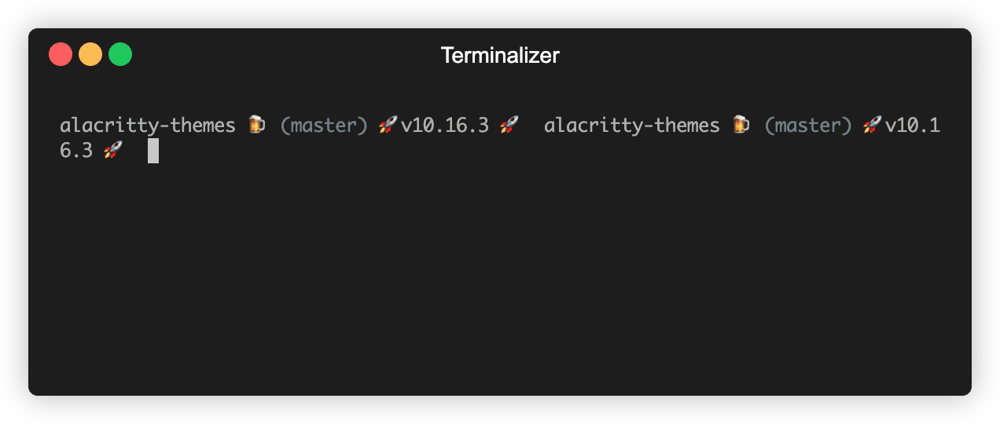

# :rainbow: alacritty-themes :lollipop:


[](https://npmjs.org/package/alacritty-themes 'View this project on npm')
[](https://github.com/semantic-release/semantic-release)
[](https://conventionalcommits.org)

Themes :candy: for [alacritty](https://github.com/alacritty/alacritty) A cross-platform, GPU-accelerated terminal emulator

To find the list of themes, you can visit the alacritty [wiki page](https://github.com/alacritty/alacritty/wiki/Color-schemes)

- Live preview the themes
- 200+ Themes to choose from
- Apply any theme with just one command at the terminal
- Option to create your `alacritty.yml` config file
- Simple, Easy and intuitive User experience

## Install

Install the `alacritty-themes` package globally with [npm](https://npmjs.com)

```
npm i -g alacritty-themes
```

If you are using `npx` you don't have to install the package:

```
npx alacritty-themes
```

If you are using Archlinux, you can install it from [AUR](https://aur.archlinux.org/packages/alacritty-themes/)

```
paru -S alacritty-themes
```

## Usage

```
alacritty-themes
```

To apply a theme directly, provide the theme name as an option

```
alacritty-themes Dracula
```

To find the themes, you can check the file names [here](/themes)



Choose the theme from the list of options by typing the theme name and press `Enter` to apply.
The list of options are cycled through automatically so you can go to the last theme
by just pressing `up arrow` key.
The search is fuzzy so you can enter any part of the theme name to search.

If no `alacritty.yml` is found in your `$HOME` path, you can create one using the `--create` or `-c` option.

```
alacritty-themes --create
```

## Backups

We have experienced some errors when stringifying.
Probably, those are happening when changing themes,
that's the reason we decided to create backups of the `alacritty.yml` before changing the theme.

This action could produce a bunch of backup files,
while we get a better solution you can remove all the backups with a
single command: `rm ~/.config/alacritty/alacritty.yml.*`

## Bonus Tip: Alias

You can also create an alias for `alacritty-themes` like `at`
Just append this below line to your `~/.bashrc` or `~/.bash_profile`

```
alias at='alacritty-themes'
```

Now you can simply use `at` to choose themes for your alacritty terminal.

```
at
```

## Discussions

If you have some questions about alacritty-themes, please use the [Discussions Tab](https://github.com/rajasegar/alacritty-themes/discussions) in the correct category that way our community can solve their questions faster.

## Contributors

**Alacritty-Themes** is built by this great community:

|  |  |
| :---------------------------------------------------------------------------------------------: | :-----------------------------------------------------------------------------------------: |
|                      <a href="https://github.com/rajasegar">@rajasegar</a>                      |                      <a href="https://github.com/juanvqz">@juanvqz</a>                      |
|                                          Chennai, IND                                           |                                         Oaxaca, MX                                          |

|  |
| :------------------------------------------------------------------------------------------------------------------: |
|                                                      You Next?                                                       |
|                                                       Internet                                                       |
